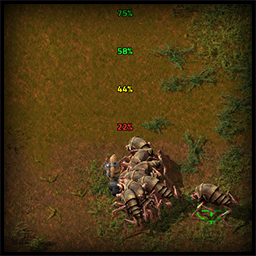
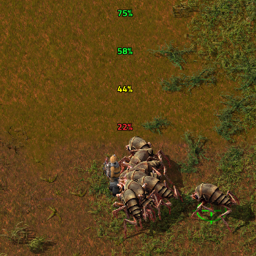
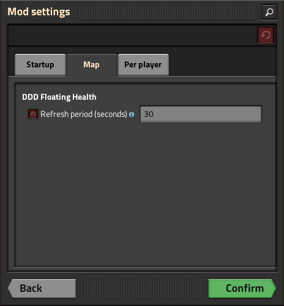

# DDDGamer's [Factorio](https://www.factorio.com/) Floating Health Mod 

When player takes damage or whenever health changes, floating health percentage numbers appear above the player

# Installation
1. In Game Install
   * Search for the mod in the `Mods` menu and Factorio will install it and restart automatically
2. Mod Portal/Manual install
   * Download the zipped file `ddd-floating-health_x.x.x.zip`
     * From the [Mod Portal](https://mods.factorio.com/mod/ddd-floating-health)
     * OR the [Latest Release](https://github.com/deniszholob/factorio-mod-floating-health/releases/latest)
   * Place into the `%appdata%/Factorio/mods/` folder, see [wiki for more details](https://wiki.factorio.com/Modding#Downloading_.26_installing_mods)

# Support Me
If you find the mod or the source code useful, consider:

* Donating Ko-fi: https://ko-fi.com/deniszholob
* Supporting on Patreon: https://www.patreon.com/deniszholob

# Related
* [Factorio Cheat Sheet](https://factoriocheatsheet.com/)
* [Soft Mod Pack](https://github.com/deniszholob/factorio-softmod-pack) that uses this mod
* [Player List Mod](https://github.com/deniszholob/factorio-mod-player-list)
* [Evolution Indicator Mod](https://github.com/deniszholob/factorio-mod-evolution-indicator)

# Screenshots

